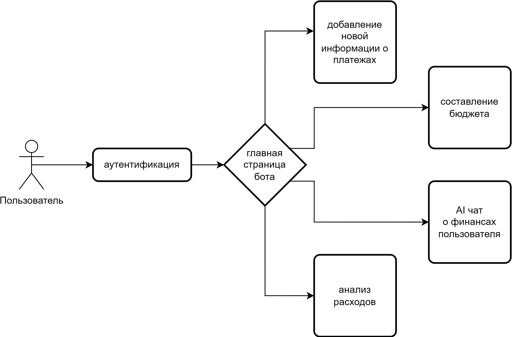
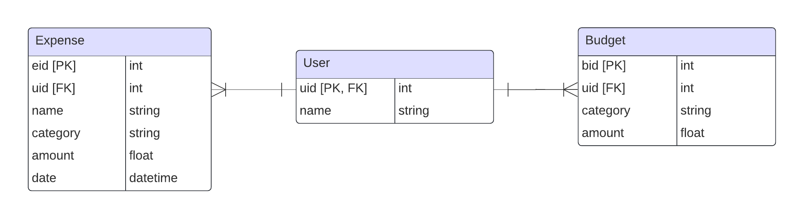

# financetracker

Телеграм-бот для трекинга и анализа финансов

## Постановка решаемой задачи

**Цель проекта:** Создать чат-бота, который поможет пользователям эффективно управлять своими финансами, предоставляя функции отслеживания расходов, составления бюджета и анализа трат.

**Функциональные требования:**
- **Отслеживание расходов**:
  - Пользователь может добавлять свои траты, указывая название траты/категорию сумму и категорию.
  - Бот сохраняет информацию о каждой трате, включая дату и время.
- **Анализ категории по названию траты**:
  - Пользователь может добавлять название траты, не указывая категорию, бот сам определит, к какой категории относится эта трата, используя OpenAI. 
- **Анализ финансов**:
  - Пользователь может запросить отчет о своих финансах за определенный период времени (например, за месяц или год).
  - Бот предоставляет статистику в виде наглядных диаграмм о расходах по категориям, общую сумму трат и другие финансовые данные.
- **Составление бюджета**:
  - Пользователь может установить бюджет на определенную категорию трат.
  - Бот отслеживает расходы пользователя в каждой категории и предоставляет информацию о том, насколько пользователь приближается к установленному бюджету.

## Описание предполагаемых инструментов решения
| Название        | Описание |
|---|---|
| PostgreSQL      | Система управления базами данных для хранения данных пользователей. |
| SQLAlchemy      | Инструмент для взаимодействия между Python и базами данных. |
| Библиотека OpenAI | Применяется для анализа финансов с помощью чат-бота. |
| Библиотека Telegram | Используется для создания ботов в Telegram. |
| Matplotlib      | Создает графики и диаграммы для визуализации расходов. |
| Docker          | Обеспечивает развертывание и управление приложением. |

## Макет интерфейса

## Схема базы данных

